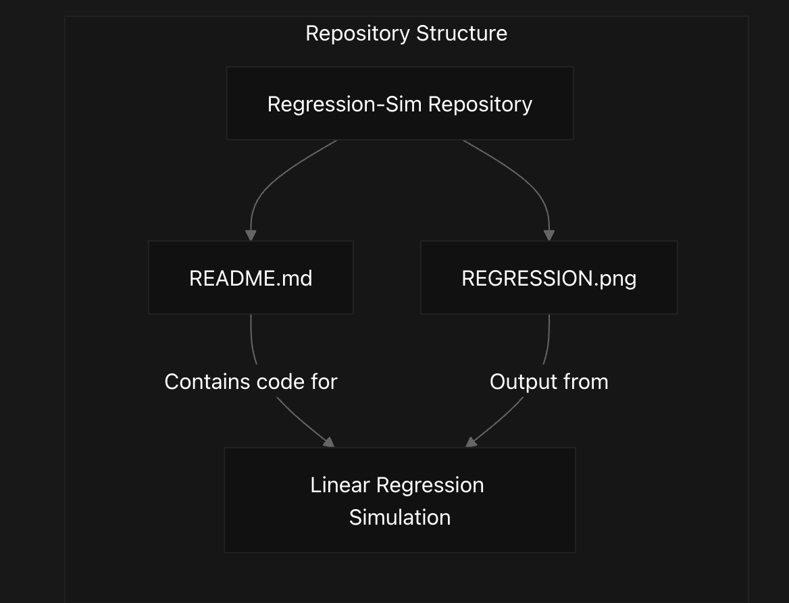
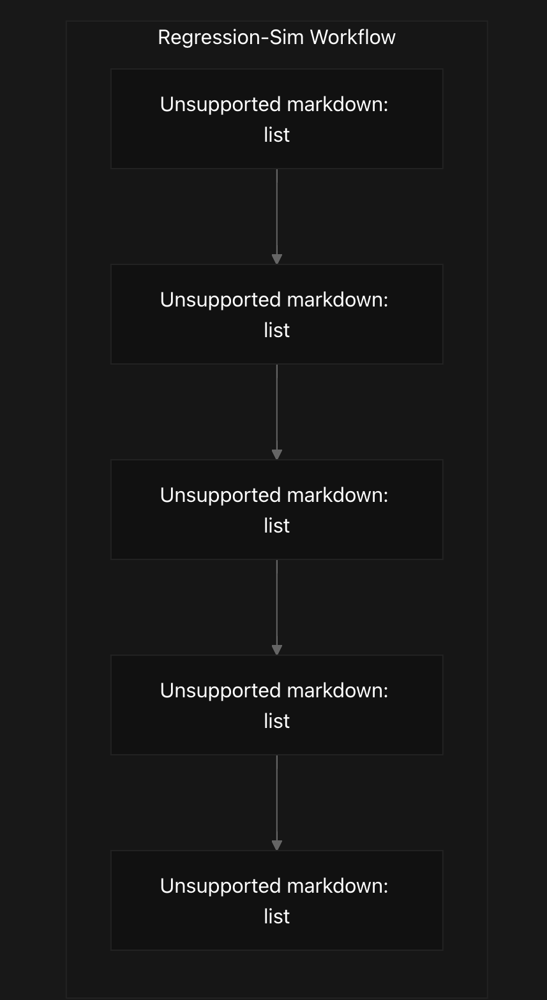
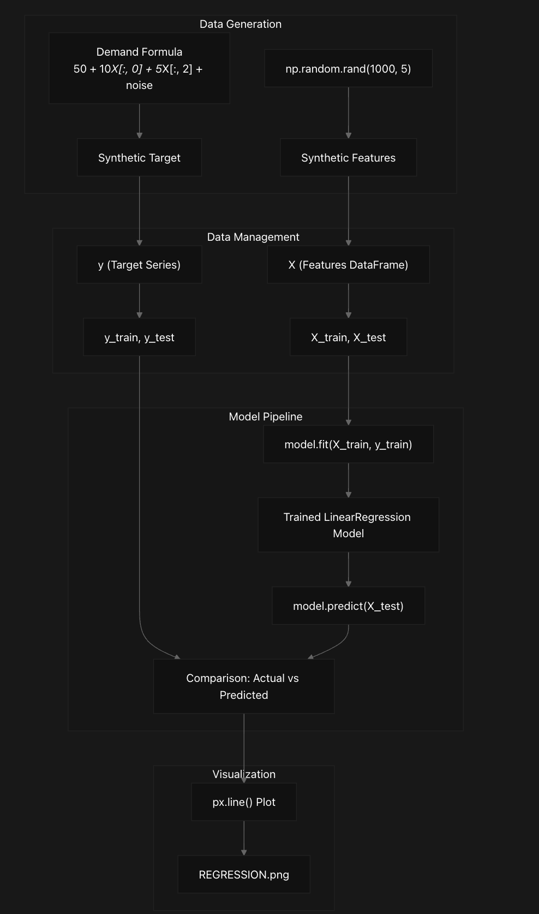
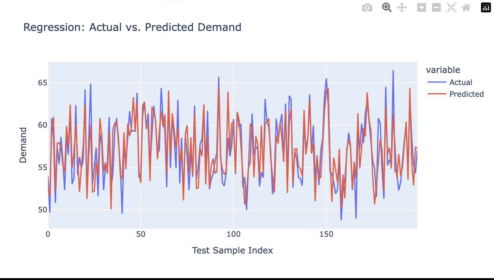

# Regression-Sim
Regression (Demand Forecasting with scikit-learn + Plotly Visualization)

## Purpose and Scope
Regression-Sim is a demand forecasting simulation that demonstrates how to implement linear regression using scikit-learn and visualize results with Plotly. This document provides an introduction to the repository's purpose and its core functionality. 
The simulation generates synthetic demand data based on multiple features, trains a linear regression model, makes predictions, and visualizes the results to showcase a complete machine learning workflow for demand forecasting.

## Repository Structure
Regression-Sim has a minimalist structure containing all functionality within a single README.md file that includes the executable code and documentation, along with an output visualization file.


## Workflow Overview
The simulation follows a standard machine learning workflow through five key stages, as indicated by the code comments in the implementation.

## Key Components
The simulation utilizes four primary Python libraries to implement its functionality:

Library	            Purpose	                Usage in Regression-Sim
NumPy	            Numerical operations	Generating synthetic data, random numbers
Pandas	            Data manipulation	    Creating and managing DataFrames
scikit-learn	    Machine learning	    LinearRegression model, train_test_split
Plotly Express	    Data visualization	    Creating interactive demand forecast plots

## Data Model
The simulation creates a synthetic dataset with features that would typically influence product demand in a real-world scenario.

## System Architecture
The following diagram illustrates how data flows through the different components of the system:


## Code Implementation Overview
The implementation consists of five distinct sections:

1. Data Preparation: Generates synthetic features and target variable (demand) using NumPy and creates a Pandas DataFrame.
- Features: price, marketing_spend, seasonality_index, competitor_price, holiday_flag
- Target: demand (determined by a linear formula with noise)
2. Train/Test Split: Divides the dataset into training (80%) and testing (20%) sets.
3. Model Training: Creates and trains a LinearRegression model from scikit-learn.
4. Prediction: Uses the trained model to predict demand values for the test set.
5. Visualization: Creates a line chart comparing actual vs. predicted demand values.
Additionally, the code prints the model coefficients and intercept for analysis.

## Demand Formula Explanation
The synthetic demand is generated using a formula that establishes relationships between features and the target:
```
demand = 50 + 10*price + 5*seasonality_index + random_noise
```
This formula indicates that:
- Base demand is 50 units
- A unit change in price increases demand by 10 units
- A unit change in seasonality_index increases demand by 5 units
- Random noise provides realistic variation
Note that the formula only uses 2 of the 5 generated features (indexes 0 and 2), making marketing_spend, competitor_price, and holiday_flag non-influential in the actual demand. This creates an opportunity for model evaluation, as an effective model should assign near-zero coefficients to these non-predictive features.

## Output
The final output of the simulation includes:
1. An interactive or static line chart visualization showing actual vs. predicted demand
2. The regression coefficients for each feature
3. The model intercept

```
    import numpy as np
    import pandas as pd
    from sklearn.linear_model import LinearRegression
    from sklearn.model_selection import train_test_split
    import plotly.express as px
    
    # 1. DATA PREPARATION
    X = np.random.rand(1000, 5)
    y = 50 + 10*X[:, 0] + 5*X[:, 2] + np.random.randn(1000)*2  # Synthetic demand
    
    df = pd.DataFrame(X, columns=['price','marketing_spend','seasonality_index','competitor_price','holiday_flag'])
    df['demand'] = y
    
    # 2. TRAIN/TEST SPLIT
    X_train, X_test, y_train, y_test = train_test_split(
        df.drop('demand', axis=1),
        df['demand'],
        test_size=0.2,
        random_state=42
    )
    
    # 3. MODEL TRAINING
    model = LinearRegression()
    model.fit(X_train, y_train)
    
    # 4. PREDICTION
    y_pred = model.predict(X_test)
    
    # 5. VISUALIZATION: Actual vs. Predicted Demand
    results_df = pd.DataFrame({'Actual': y_test.values, 'Predicted': y_pred})
    results_df.reset_index(drop=True, inplace=True)
    
    fig = px.line(results_df, title='Regression: Actual vs. Predicted Demand')
    fig.update_layout(xaxis_title='Test Sample Index', yaxis_title='Demand')
    fig.show()
```

    
    print("Regression Coefficients:", model.coef_)
    print("Intercept:", model.intercept_)
